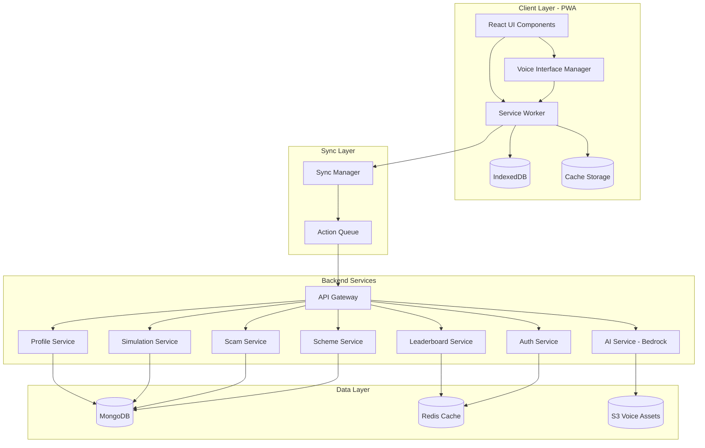

# Design Document: Kishan Saathi

## Overview

Kishan Saathi is a Progressive Web Application (PWA) that provides financial literacy training for Indian farmers through gamified simulations. The system architecture prioritizes offline-first operation, voice-based interaction, and minimal resource consumption to serve users with basic smartphones and limited connectivity.

### Key Design Principles

1. **Offline-First**: All core functionality works without internet connectivity
2. **Voice-First**: Primary interaction through speech, minimal text input required
3. **Progressive Enhancement**: Graceful degradation on low-end devices
4. **Data Minimization**: Aggressive compression and caching strategies
5. **Cultural Sensitivity**: Region-specific content and dialect-aware AI
6. **Privacy by Design**: Minimal data collection, local-first storage

### Technology Stack

**Frontend:**
- React 18 with TypeScript for type safety and component reusability
- Vite for fast builds and optimized bundling
- Workbox for service worker management and offline caching
- IndexedDB for local data persistence
- Web Speech API with fallback to cloud STT/TTS

**Backend:**
- Node.js 20 LTS with Express and TypeScript
- MongoDB for flexible document storage
- Redis for session management and leaderboard caching
- Amazon Bedrock (Claude 3 Haiku) for contextual AI and dialect translation

**Infrastructure:**
- AWS Lambda for serverless compute (cost optimization)
- CloudFront CDN for static asset delivery
- S3 for voice asset storage
- API Gateway for REST endpoints

## Architecture

### System Architecture Diagram



### Offline-First Architecture

The application follows a "local-first, sync-when-possible" pattern:

1. **All user actions are processed locally first** using cached data and local state
2. **Actions are queued** in IndexedDB for later synchronization
3. **Background sync** uploads queued actions when connectivity resumes
4. **Conflict resolution** uses last-write-wins with server authority for leaderboards
5. **Critical data** (schemes, scam patterns) syncs on app launch when online

### Data Flow Patterns

**Voice Input Flow:**
```
User Speech → Web Speech API (if available) → Voice Interface Manager
                ↓ (fallback)
            Queue for Cloud STT → Sync Manager → Backend STT Service
                ↓
            Normalized Text → Command Parser → Action Dispatcher
```

**Simulation State Flow:**
```
User Decision → Local State Update → IndexedDB Persistence
                ↓
            Sync Queue → Background Sync → Backend Validation
                ↓
            Server State Update → Leaderboard Recalculation
```

## Components and Interfaces

### 1. Voice Interface Manager

**Responsibilities:**
- Speech-to-text conversion using Web Speech API with cloud fallback
- Text-to-speech output with voice caching
- Language and dialect detection
- Audio compression for bandwidth optimization

**Key Interfaces:**

```typescript
interface VoiceConfig {
  language: SupportedLanguage;
  dialect?: string;
  speechRate: number;
  useCloudSTT: boolean;
}

interface VoiceCommand {
  rawText: string;
  normalizedText: string;
  confidence: number;
  timestamp: number;
  language: SupportedLanguage;
}

interface TTSRequest {
  text: string;
  language: SupportedLanguage;
  priority: 'high' | 'normal' | 'low';
  cacheKey?: string;
}

class VoiceInterfaceManager {
  async startListening(config: VoiceConfig): Promise<void>;
  async stopListening(): Promise<VoiceCommand>;
  async speak(request: TTSRequest): Promise<void>;
  async preloadVoiceAssets(language: SupportedLanguage): Promise<void>;
  isWebSpeechAvailable(): boolean;
}
```

**Implementation Notes:**
- Use Web Speech API when available (Chrome, Edge on Android)
- Fall back to queued cloud STT for other browsers
- Cache TTS audio in IndexedDB with LRU eviction
- Compress audio using Opus codec at 16kbps for voice
- Implement voice activity detection to reduce false triggers

### 2. Simulation Engine

**Responsibilities:**
- Agricultural cycle state management
- Financial calculations (income, expenses, savings)
- Time progression and event scheduling
- Decision consequence computation

**Key Interfaces:**

```typescript
interface SimulationState {
  userId: string;
  season: 'kharif' | 'rabi';
  currentWeek: number;
  totalWeeks: number;
  balance: number;
  crops: CropAllocation[];
  expenses: ExpenseRecord[];
  events: SimulationEvent[];
  decisions: DecisionRecord[];
}

interface CropAllocation {
  cropType: string;
  landArea: number;
  investmentAmount: number;
  expectedYield: number;
  actualYield?: number;
}

interface SimulationEvent {
  id: string;
  type: 'weather' | 'pest' | 'market' | 'scheme';
  severity: 'low' | 'medium' | 'high';
  description: string;
  financialImpact: number;
  occurredAt: number;
}

interface DecisionScenario {
  id: string;
  title: string;
  description: string;
  context: SimulationState;
  options: DecisionOption[];
  educationalContent: string;
}

interface DecisionOption {
  id: string;
  text: string;
  financialImpact: number;
  consequenceDescription: string;
  correctnessScore: number; // 0-100
}

class SimulationEngine {
  initializeSeason(userId: string, region: string, crops: string[]): SimulationState;
  advanceTime(state: SimulationState, weeks: number): SimulationState;
  generateRandomEvent(state: SimulationState): SimulationEvent;
  applyDecision(state: SimulationState, decision: DecisionOption): SimulationState;
  calculateSeasonSummary(state: SimulationState): SeasonSummary;
  forecastExpenses(state: SimulationState, weeksAhead: number): ExpenseForecast;
}
```

**Event Generation Algorithm:**
- Events occur with probability based on current week and region
- Severity influenced by user's financial buffer and past decisions
- Maximum 1 major event per 2 weeks to avoid overwhelming users
- Event types weighted by regional agricultural patterns

**Financial Calculation Rules:**
- Income = (Crop Yield × Market Price) - (Investment + Expenses)
- Expenses categorized: Seeds (15%), Fertilizer (20%), Pesticides (10%), Labor (30%), Living (25%)
- Budget forecasting uses 3-month rolling average with seasonal adjustments
- Savings recommendations: minimum 20% of harvest income

### 3. Scam Detector Module

**Responsibilities:**
- Scam scenario generation and presentation
- User response evaluation
- Educational feedback delivery
- Scam pattern database management

**Key Interfaces:**

```typescript
interface ScamScenario {
  id: string;
  type: 'call' | 'sms' | 'otp' | 'app' | 'agent';
  difficulty: 'easy' | 'medium' | 'hard';
  content: string;
  indicators: ScamIndicator[];
  correctResponse: 'accept' | 'reject' | 'verify';
  explanation: string;
}

interface ScamIndicator {
  type: 'urgency' | 'authority' | 'reward' | 'threat' | 'personal_info_request';
  description: string;
  severity: number; // 1-10
}

interface ScamResponse {
  scenarioId: string;
  userChoice: 'accept' | 'reject' | 'verify';
  isCorrect: boolean;
  pointsAwarded: number;
  feedback: string;
  timestamp: number;
}

class ScamDetector {
  generateScenario(difficulty: 'easy' | 'medium' | 'hard'): ScamScenario;
  evaluateResponse(scenario: ScamScenario, userChoice: string): ScamResponse;
  updateScamDatabase(newPatterns: ScamPattern[]): void;
  getScamStatistics(userId: string): ScamStats;
  adaptDifficulty(userStats: ScamStats): 'easy' | 'medium' | 'hard';
}
```

**Scam Pattern Database:**
- Maintained as JSON documents in MongoDB
- Updated weekly from verified sources (CERT-In, RBI alerts)
- Categorized by target demographic and fraud type
- Includes real-world examples with identifying details anonymized

**Difficulty Adaptation:**
- Easy: Obvious scams with clear red flags (70% of indicators visible)
- Medium: Realistic scams with subtle indicators (50% of indicators visible)
- Hard: Sophisticated scams requiring careful analysis (30% of indicators visible)
- Progression: 5 correct identifications at current level → advance to next level

### 4. Profile Manager

**Responsibilities:**
- User profile creation and updates
- Regional configuration management
- Preference persistence
- Device capability detection

**Key Interfaces:**

```typescript
interface UserProfile {
  id: string;
  phoneNumber: string;
  region: RegionConfig;
  language: SupportedLanguage;
  literacyLevel: 'low' | 'medium' | 'high';
  deviceCapabilities: DeviceCapabilities;
  preferences: UserPreferences;
  createdAt: number;
  lastSyncAt: number;
}

interface RegionConfig {
  state: string;
  district: string;
  crops: string[];
  seasonCalendar: SeasonCalendar;
  marketPrices: Record<string, number>;
  schemes: string[]; // IDs of applicable schemes
}

interface DeviceCapabilities {
  hasWebSpeech: boolean;
  storageAvailable: number; // MB
  connectionType: 'wifi' | '4g' | '3g' | '2g' | 'offline';
  screenSize: 'small' | 'medium' | 'large';
  supportsWebGL: boolean;
}

interface UserPreferences {
  voiceSpeed: number; // 0.5 - 2.0
  dataUsageLimit: number; // MB per month
  notificationsEnabled: boolean;
  lowResourceMode: boolean;
  tutorialCompleted: boolean;
}

class ProfileManager {
  createProfile(phoneNumber: string, region: string, language: SupportedLanguage): Promise<UserProfile>;
  updateProfile(userId: string, updates: Partial<UserProfile>): Promise<UserProfile>;
  getProfile(userId: string): Promise<UserProfile>;
  detectDeviceCapabilities(): DeviceCapabilities;
  configureRegionalSettings(region: string): Promise<RegionConfig>;
}
```

**Regional Configuration:**
- Region data stored as hierarchical JSON: Country → State → District
- Each region includes: crop database, season calendar, scheme IDs, market benchmarks
- Configuration loaded on profile creation and cached locally
- Updates fetched monthly or on explicit user request

### 5. Sync Manager

**Responsibilities:**
- Offline action queuing
- Background synchronization
- Conflict resolution
- Network status monitoring

**Key Interfaces:**

```typescript
interface SyncAction {
  id: string;
  type: 'profile_update' | 'simulation_progress' | 'decision_made' | 'scam_response' | 'achievement_earned';
  payload: any;
  timestamp: number;
  retryCount: number;
  priority: 'critical' | 'high' | 'normal' | 'low';
}

interface SyncResult {
  actionId: string;
  success: boolean;
  serverTimestamp?: number;
  conflicts?: ConflictResolution[];
  error?: string;
}

interface ConflictResolution {
  field: string;
  localValue: any;
  serverValue: any;
  resolution: 'use_local' | 'use_server' | 'merge';
}

class SyncManager {
  queueAction(action: SyncAction): Promise<void>;
  syncNow(): Promise<SyncResult[]>;
  registerBackgroundSync(): void;
  getQueueStatus(): { pending: number; failed: number; lastSync: number };
  resolveConflict(conflict: ConflictResolution): any;
  clearQueue(): Promise<void>;
}
```

**Synchronization Strategy:**
- **Immediate sync** for critical actions (profile creation, scheme applications)
- **Batched sync** for normal actions (every 5 minutes when online)
- **Background sync** using Service Worker Background Sync API
- **Exponential backoff** for failed syncs (1s, 2s, 4s, 8s, max 60s)
- **Conflict resolution**: Server wins for leaderboards, local wins for simulation state

### 6. Scheme Database Service

**Responsibilities:**
- Government scheme storage and retrieval
- Eligibility matching
- Simplified content generation
- Application guidance

**Key Interfaces:**

```typescript
interface GovernmentScheme {
  id: string;
  name: string;
  nameTranslations: Record<SupportedLanguage, string>;
  description: string;
  descriptionTranslations: Record<SupportedLanguage, string>;
  eligibility: EligibilityCriteria;
  benefits: string[];
  applicationProcess: ApplicationStep[];
  documents: string[];
  region: string[]; // State/district codes
  category: 'subsidy' | 'insurance' | 'loan' | 'training' | 'equipment';
  lastUpdated: number;
}

interface EligibilityCriteria {
  minAge?: number;
  maxAge?: number;
  landOwnership?: 'owner' | 'tenant' | 'any';
  cropTypes?: string[];
  incomeLimit?: number;
  region?: string[];
}

interface ApplicationStep {
  stepNumber: number;
  instruction: string;
  instructionTranslations: Record<SupportedLanguage, string>;
  voiceGuidance: string;
  requiredDocuments: string[];
}

class SchemeDatabase {
  findEligibleSchemes(profile: UserProfile): Promise<GovernmentScheme[]>;
  getSchemeDetails(schemeId: string, language: SupportedLanguage): Promise<GovernmentScheme>;
  simplifyContent(content: string, literacyLevel: 'low' | 'medium' | 'high'): string;
  generateVoiceGuidance(scheme: GovernmentScheme, language: SupportedLanguage): Promise<string>;
  trackSchemeInteraction(userId: string, schemeId: string, action: 'viewed' | 'applied'): Promise<void>;
}
```

**Content Simplification Rules:**
- **Low literacy**: 5th grade reading level, short sentences, common words only
- **Medium literacy**: 8th grade reading level, moderate complexity
- **High literacy**: Original government language preserved
- Use AI (Claude) to rewrite complex bureaucratic language
- Maintain accuracy while improving comprehension

### 7. Leaderboard Service

**Responsibilities:**
- User ranking calculation
- Regional leaderboard generation
- Achievement tracking
- Privacy-preserving display

**Key Interfaces:**

```typescript
interface LeaderboardEntry {
  rank: number;
  userId: string;
  displayName: string; // Anonymized
  score: number;
  region: string;
  achievements: number;
  lastUpdated: number;
}

interface UserScore {
  userId: string;
  simulationScore: number; // Based on financial outcomes
  scamScore: number; // Based on scam identification accuracy
  achievementScore: number; // Based on milestones
  totalScore: number;
}

interface Achievement {
  id: string;
  title: string;
  description: string;
  icon: string;
  points: number;
  unlockedAt?: number;
  category: 'simulation' | 'scam' | 'scheme' | 'social';
}

class LeaderboardService {
  calculateUserScore(userId: string): Promise<UserScore>;
  getRegionalLeaderboard(region: string, limit: number): Promise<LeaderboardEntry[]>;
  getUserRank(userId: string): Promise<number>;
  awardAchievement(userId: string, achievementId: string): Promise<Achievement>;
  getAchievements(userId: string): Promise<Achievement[]>;
  anonymizeDisplayName(userId: string): string;
}
```

**Scoring Algorithm:**
```
Total Score = (Simulation Score × 0.5) + (Scam Score × 0.3) + (Achievement Score × 0.2)

Simulation Score = (Savings Rate × 40) + (Decision Quality × 30) + (Seasons Completed × 30)
Scam Score = (Identification Accuracy × 100)
Achievement Score = Sum of achievement points
```

**Privacy Measures:**
- Display names generated as "Farmer_[Region]_[Random4Digits]"
- No personal information visible on leaderboards
- Users can opt out of leaderboards entirely
- Regional leaderboards limited to district level (not village)

### 8. AI Service Integration

**Responsibilities:**
- Contextual advice generation
- Dialect translation
- Content simplification
- Conversational assistance

**Key Interfaces:**

```typescript
interface AIRequest {
  type: 'advice' | 'translation' | 'simplification' | 'conversation';
  context: {
    userId: string;
    simulationState?: SimulationState;
    userProfile: UserProfile;
    conversationHistory?: Message[];
  };
  input: string;
  targetLanguage: SupportedLanguage;
}

interface AIResponse {
  output: string;
  confidence: number;
  tokensUsed: number;
  cached: boolean;
  sources?: string[]; // For scheme references
}

class AIService {
  async generateAdvice(request: AIRequest): Promise<AIResponse>;
  async translateDialect(text: string, fromLang: string, toLang: SupportedLanguage): Promise<string>;
  async simplifyText(text: string, targetLevel: 'low' | 'medium' | 'high'): Promise<string>;
  async handleConversation(request: AIRequest): Promise<AIResponse>;
  cacheResponse(request: AIRequest, response: AIResponse): Promise<void>;
}
```

**AI Usage Optimization:**
- Cache common responses in Redis (TTL: 7 days)
- Use Claude 3 Haiku for cost efficiency ($0.25/1M input tokens)
- Limit context window to 4K tokens for faster responses
- Batch non-urgent requests to reduce API calls
- Fallback to template-based responses when offline

**Prompt Engineering:**
```
System: You are a financial advisor for Indian farmers. Provide advice in simple language appropriate for rural users with limited financial literacy. Always consider regional agricultural practices and government schemes.

Context: User is a {region} farmer growing {crops} in {season} season. Current balance: {balance}. Recent events: {events}.

User Question: {question}

Respond in {language} using simple words. Keep response under 100 words.
```

## Data Models

### User Collection (MongoDB)

```typescript
{
  _id: ObjectId,
  phoneNumber: string, // Hashed
  profile: {
    region: {
      state: string,
      district: string,
      crops: string[],
      seasonCalendar: {
        kharif: { start: number, end: number },
        rabi: { start: number, end: number }
      }
    },
    language: string,
    literacyLevel: string,
    deviceCapabilities: object,
    preferences: object
  },
  simulation: {
    currentState: SimulationState,
    history: SimulationState[],
    totalSeasonsCompleted: number,
    averageSavingsRate: number
  },
  scamTraining: {
    totalAttempts: number,
    correctIdentifications: number,
    accuracy: number,
    currentDifficulty: string,
    completedScenarios: string[]
  },
  achievements: [
    {
      achievementId: string,
      unlockedAt: number
    }
  ],
  schemeInteractions: [
    {
      schemeId: string,
      action: string,
      timestamp: number
    }
  ],
  createdAt: number,
  lastActiveAt: number,
  lastSyncAt: number
}
```

### Scheme Collection (MongoDB)

```typescript
{
  _id: ObjectId,
  schemeId: string,
  name: string,
  nameTranslations: {
    hi: string,
    ta: string,
    te: string,
    bn: string,
    mr: string,
    pa: string
  },
  description: string,
  descriptionTranslations: object,
  eligibility: {
    minAge: number,
    maxAge: number,
    landOwnership: string,
    cropTypes: string[],
    incomeLimit: number,
    regions: string[]
  },
  benefits: string[],
  applicationProcess: ApplicationStep[],
  documents: string[],
  category: string,
  sourceUrl: string,
  lastUpdated: number,
  active: boolean
}
```

### Scam Pattern Collection (MongoDB)

```typescript
{
  _id: ObjectId,
  patternId: string,
  type: string,
  difficulty: string,
  template: string,
  indicators: [
    {
      type: string,
      description: string,
      severity: number
    }
  ],
  correctResponse: string,
  explanation: string,
  explanationTranslations: object,
  realWorldExample: string,
  source: string,
  reportedDate: number,
  active: boolean
}
```

### Leaderboard Cache (Redis)

```
Key: leaderboard:{region}:{date}
Value: Sorted Set of {userId: score}
TTL: 24 hours

Key: user:score:{userId}
Value: Hash {simulationScore, scamScore, achievementScore, totalScore, lastUpdated}
TTL: 7 days

Key: achievements:{userId}
Value: Set of achievementIds
TTL: 30 days
```

### IndexedDB Schema (Client-Side)

```typescript
// Database: kishan-saathi-v1

// Store: userProfile
{
  id: string (primary key),
  profile: UserProfile,
  lastUpdated: number
}

// Store: simulationState
{
  id: string (primary key),
  state: SimulationState,
  lastUpdated: number
}

// Store: syncQueue
{
  id: string (primary key),
  action: SyncAction,
  status: 'pending' | 'syncing' | 'failed',
  lastAttempt: number
}

// Store: voiceCache
{
  cacheKey: string (primary key),
  audioBlob: Blob,
  language: string,
  text: string,
  createdAt: number,
  accessCount: number
}

// Store: schemeCache
{
  schemeId: string (primary key),
  scheme: GovernmentScheme,
  cachedAt: number
}

// Store: scamScenarios
{
  scenarioId: string (primary key),
  scenario: ScamScenario,
  completed: boolean,
  completedAt: number
}
```


## Correctness Properties

*A property is a characteristic or behavior that should hold true across all valid executions of a system—essentially, a formal statement about what the system should do. Properties serve as the bridge between human-readable specifications and machine-verifiable correctness guarantees.*

### Property Reflection

After analyzing all acceptance criteria, I've identified several areas where properties can be consolidated:

**Consolidations Made:**
- Profile storage properties (1.4, 1.5) → Combined into single profile persistence property
- Voice interface language support (2.1, 2.2) → Combined into language support property
- Expense tracking and summary generation (3.3, 3.6) → Related but distinct, kept separate
- Scam feedback properties (5.2, 5.3) → Combined into single feedback property
- Scheme storage and filtering (6.1, 6.5) → Combined into scheme data integrity property
- Encryption properties (9.1, 9.6) → Combined into data lifecycle encryption property
- Metric tracking properties (13.1, 13.3, 13.4) → Combined into comprehensive metrics property
- Regional data properties (14.1, 14.2, 14.4) → Combined into regional configuration property

### Core Properties

#### Property 1: Regional Configuration Completeness
*For any* region selected by a user, the Profile_Manager should configure all required hyper-local settings including crops list, season calendar, applicable schemes, and market prices.

**Validates: Requirements 1.2, 14.1, 14.2, 14.4**

#### Property 2: Profile Persistence Round-Trip
*For any* user profile with preferences (language, region, literacy level, device capabilities), storing the profile locally and then retrieving it should produce an equivalent profile object.

**Validates: Requirements 1.4, 1.5**

#### Property 3: Multilingual Voice Interface Support
*For any* supported language (Hindi, Tamil, Telugu, Bengali, Marathi, Punjabi), the Voice_Interface should accept that language for both speech-to-text input and text-to-speech output.

**Validates: Requirements 2.1, 2.2**

#### Property 4: Offline Voice Input Queuing
*For any* voice input received while offline, the Voice_Interface should queue the input locally and process it when connectivity resumes, maintaining input order.

**Validates: Requirements 2.4**

#### Property 5: Dialect Normalization
*For any* dialect variation of a supported language, the System should normalize the input to standard form for processing while preserving semantic meaning.

**Validates: Requirements 2.6**

#### Property 6: Season Income Initialization
*For any* combination of crops and region, starting a new season should initialize virtual income greater than zero based on regional market prices and crop yields.

**Validates: Requirements 3.2**

#### Property 7: Expense Category Completeness
*For any* expense recorded in the simulation, it should be categorized into exactly one of: seeds, fertilizers, pesticides, labor, or living expenses.

**Validates: Requirements 3.3**

#### Property 8: Budget Calculation Correctness
*For any* harvest income allocation, the remaining budget should equal total income minus allocated expenses, and forecasts should be generated for the next 4 weeks minimum.

**Validates: Requirements 3.4**

#### Property 9: Time Progression Consistency
*For any* simulation state, advancing time by N real days should result in exactly N simulated weeks of progression with consistent state updates.

**Validates: Requirements 3.5**

#### Property 10: Season Summary Completeness
*For any* completed season, the financial summary should include total income, total expenses by category, net savings, and savings rate percentage.

**Validates: Requirements 3.6**

#### Property 11: Event Type Diversity
*For any* active simulation running for at least 4 weeks, the generated events should include at least two different types from: pest attacks, weather changes, or market fluctuations.

**Validates: Requirements 4.1**

#### Property 12: Decision Option Variability
*For any* decision scenario presented, there should be at least 2 response options with different financial consequences (impacts differ by at least 10%).

**Validates: Requirements 4.2**

#### Property 13: Decision Impact Application
*For any* decision made in a scenario, the simulation state's balance should change by exactly the decision's specified financial impact amount.

**Validates: Requirements 4.3**

#### Property 14: Educational Feedback Provision
*For any* completed decision scenario, the System should provide feedback text explaining the outcome with length greater than 20 characters.

**Validates: Requirements 4.4**

#### Property 15: Adaptive Difficulty Progression
*For any* user with 5 consecutive correct decisions at current difficulty, the next scenario should be at a higher difficulty level (or remain at highest if already there).

**Validates: Requirements 4.5**

#### Property 16: Performance-Based Point Award
*For any* two completed scenarios, the scenario with higher decision quality score should award equal or more points than the lower quality decision.

**Validates: Requirements 4.6**

#### Property 17: Scam Type Coverage
*For any* set of 10 scam scenarios generated, at least 3 different scam types should be represented from: call, SMS, OTP, app, or agent.

**Validates: Requirements 5.1**

#### Property 18: Scam Identification Feedback
*For any* scam scenario response, the System should provide feedback where correct identifications include positive reinforcement and incorrect identifications include educational content explaining indicators.

**Validates: Requirements 5.2, 5.3**

#### Property 19: Scam Accuracy Tracking
*For any* sequence of scam identification attempts, the calculated accuracy should equal (correct identifications / total attempts) × 100.

**Validates: Requirements 5.5**

#### Property 20: Scam Difficulty Adaptation
*For any* user achieving 80% accuracy over 10 scenarios at current difficulty, the next scenario should be at a higher difficulty level.

**Validates: Requirements 5.6**

#### Property 21: Scheme Data Integrity
*For any* government scheme stored in the database, it should contain all required fields: name translations, eligibility criteria, benefits list, application process steps, and regional applicability.

**Validates: Requirements 6.1**

#### Property 22: Scheme Eligibility Matching
*For any* user profile and scheme, if the profile satisfies all eligibility criteria (age, region, crop type), the scheme should appear in the user's eligible schemes list.

**Validates: Requirements 6.2, 6.5**

#### Property 23: Literacy-Adaptive Content
*For any* scheme description, generating simplified versions for different literacy levels (low, medium, high) should produce texts with different complexity where low < medium < high in word count and sentence length.

**Validates: Requirements 6.3**

#### Property 24: Scheme Guidance Provision
*For any* scheme details request, the System should provide application guidance containing at least one step with instructions and required documents.

**Validates: Requirements 6.4**

#### Property 25: Scheme Interaction Tracking
*For any* scheme viewed or applied for by a user, the interaction should be recorded with scheme ID, action type, and timestamp.

**Validates: Requirements 6.6**

#### Property 26: Offline Core Functionality
*For any* simulation state, when connectivity is unavailable, the user should be able to make decisions, complete scam scenarios, and advance time with all changes persisted locally.

**Validates: Requirements 7.2**

#### Property 27: Offline Action Storage
*For any* user action performed while offline, the action should be stored in the local sync queue with type, payload, timestamp, and priority.

**Validates: Requirements 7.3**

#### Property 28: Essential Content Caching
*For any* user profile, the local cache should contain voice assets for the user's language, at least 5 scam scenarios, and at least 3 eligible schemes.

**Validates: Requirements 7.5**

#### Property 29: LRU Cache Eviction
*For any* cache at storage limit, adding new content should remove the least-recently-used non-critical item while preserving all critical data (user profile, current simulation state).

**Validates: Requirements 7.6**

#### Property 30: Leaderboard Ranking Correctness
*For any* set of users with different total scores, the leaderboard ranking should order them in descending score order where rank 1 has the highest score.

**Validates: Requirements 8.1**

#### Property 31: Username Anonymization
*For any* leaderboard entry, the displayed username should not contain the user's phone number, real name, or any personally identifiable information.

**Validates: Requirements 8.2**

#### Property 32: Regional Leaderboard Filtering
*For any* regional leaderboard for district D, all entries should be users whose profile region matches district D.

**Validates: Requirements 8.3**

#### Property 33: Rank Achievement Notification
*For any* user whose rank improves from rank N to rank M (where M < N), a notification should be triggered with the new rank information.

**Validates: Requirements 8.4**

#### Property 34: Peer Comparison Calculation
*For any* region with multiple users, the peer comparison average should equal the mean of all users' scores in that region.

**Validates: Requirements 8.5**

#### Property 35: Data Encryption at Rest
*For any* user data stored locally or on the server, the stored representation should be encrypted and not readable as plaintext.

**Validates: Requirements 9.1**

#### Property 36: Data Deletion Completeness
*For any* user requesting data deletion, after processing the request, querying for that user's data should return no results across all data stores.

**Validates: Requirements 9.5**

#### Property 37: Voice Recording Cleanup
*For any* voice input processed to text, the original audio recording should be deleted from storage within 60 seconds of successful conversion.

**Validates: Requirements 9.6**

#### Property 38: Network Request Compression
*For any* network request payload, the transmitted size should be less than the uncompressed size when payload exceeds 1KB.

**Validates: Requirements 10.1**

#### Property 39: Delta Synchronization
*For any* sync operation with only partial data changes, the transmitted data size should be proportional to changed fields, not total data size.

**Validates: Requirements 10.2**

#### Property 40: Audio Format Optimization
*For any* voice asset downloaded, the file format should be Opus or AAC with bitrate not exceeding 32kbps for speech content.

**Validates: Requirements 10.3**

#### Property 41: Data Usage Tracking
*For any* feature usage (voice, sync, AI), the data consumption should be tracked and reflected in the usage dashboard with accuracy within 5%.

**Validates: Requirements 10.4**

#### Property 42: Data Limit Enforcement
*For any* user-defined data limit, when usage exceeds the limit, non-essential synchronization should be paused and an alert should be shown.

**Validates: Requirements 10.5**

#### Property 43: Update Prioritization
*For any* sync queue containing both critical updates (security, schemes) and optional updates (leaderboards), critical updates should be processed first.

**Validates: Requirements 10.6**

#### Property 44: Lazy Loading Implementation
*For any* non-critical feature module (leaderboards, achievements), the module should not be loaded in the initial bundle and should only load when accessed.

**Validates: Requirements 11.4**

#### Property 45: Low-Resource Mode Effects
*For any* UI component with animations, enabling low-resource mode should disable all animations and reduce DOM complexity.

**Validates: Requirements 11.5**

#### Property 46: Storage Alert Triggering
*For any* device with available storage below 100MB, the System should display a storage alert and offer cache clearing options.

**Validates: Requirements 11.6**

#### Property 47: Contextual AI Advice
*For any* help request, the AI-generated advice should reference at least one element from the current simulation state (balance, season, recent events) or user history.

**Validates: Requirements 12.1**

#### Property 48: AI Response Translation
*For any* AI-generated response, the output should be in the user's selected language as specified in their profile.

**Validates: Requirements 12.2**

#### Property 49: Financial Advice Citations
*For any* AI financial advice response, if relevant government schemes exist for the user's situation, at least one scheme should be cited in the response.

**Validates: Requirements 12.3**

#### Property 50: Adaptive Advice Complexity
*For any* two users with different literacy levels (low vs high), AI advice for the same situation should have different complexity where low literacy receives simpler language.

**Validates: Requirements 12.4**

#### Property 51: AI Fallback Guidance
*For any* help request when offline, the System should provide cached guidance relevant to the user's current context without requiring AI processing.

**Validates: Requirements 12.5**

#### Property 52: AI Query Limitation
*For any* user session, AI queries should only be made for explicit help requests or complex decision scenarios, not for routine operations.

**Validates: Requirements 12.6**

#### Property 53: Comprehensive Metrics Tracking
*For any* user activity, the System should track and update metrics for seasons completed, decisions made, scams identified, and schemes explored with each relevant action.

**Validates: Requirements 13.1**

#### Property 54: Milestone Achievement Award
*For any* user reaching a defined milestone (e.g., 5 seasons completed, 90% scam accuracy), an achievement should be awarded with unique ID and unlock timestamp.

**Validates: Requirements 13.2**

#### Property 55: Progress Dashboard Completeness
*For any* user, the progress dashboard should display improvement metrics over time including financial literacy score trend and decision quality trend.

**Validates: Requirements 13.3**

#### Property 56: Financial Literacy Score Calculation
*For any* user, the financial literacy score should be calculated from simulation performance (savings rate, decision quality) with score range 0-100.

**Validates: Requirements 13.4**

#### Property 57: Conditional Achievement Sharing
*For any* unlocked achievement, it should only appear on the leaderboard if the user has granted sharing permission in their preferences.

**Validates: Requirements 13.5**

#### Property 58: Weekly Summary Generation
*For any* user active for at least 7 days, a weekly summary should be generated containing progress metrics and improvement suggestions.

**Validates: Requirements 13.6**

#### Property 59: Event Probability Regional Adjustment
*For any* two regions with different climate patterns, the probability distribution of weather events should differ according to regional agricultural data.

**Validates: Requirements 14.3**

#### Property 60: Regional Price Display
*For any* market price displayed, it should use the regional benchmark price and local measurement unit (quintal, kg) appropriate for the user's region.

**Validates: Requirements 14.5**

#### Property 61: Dynamic Region Addition
*For any* new region added to the regional database, users should be able to select it and receive appropriate configuration without application update.

**Validates: Requirements 14.6**

#### Property 62: Context-Sensitive Help Availability
*For any* application state, invoking the help command should provide assistance relevant to the current screen or feature being used.

**Validates: Requirements 15.2**

#### Property 63: Proactive Assistance Triggering
*For any* user with 3 consecutive failed attempts at a feature, the System should proactively offer tutorial or help content for that feature.

**Validates: Requirements 15.3**

#### Property 64: Practice Mode Isolation
*For any* actions performed in practice mode, the user's main simulation progress, scores, and statistics should remain unchanged.

**Validates: Requirements 15.4**

#### Property 65: Tutorial Replay Accessibility
*For any* user at any time, accessing the settings menu should provide options to replay all completed tutorials.

**Validates: Requirements 15.5**

#### Property 66: Adaptive Onboarding Pacing
*For any* user completing tutorials, if completion time exceeds average by 50%, subsequent tutorial steps should include additional explanations and slower pacing.

**Validates: Requirements 15.6**

## Error Handling

### Error Categories and Strategies

**1. Network Errors**
- **Strategy**: Graceful degradation with offline-first approach
- **Handling**:
  - Queue failed requests in IndexedDB
  - Retry with exponential backoff (1s, 2s, 4s, 8s, max 60s)
  - Show user-friendly message: "Working offline. Changes will sync when connected."
  - Provide manual sync option in settings

**2. Voice Processing Errors**
- **Strategy**: Fallback chain with user feedback
- **Handling**:
  - Web Speech API fails → Queue for cloud STT
  - Cloud STT fails → Prompt user to try again or use text input
  - Low confidence (<70%) → Ask for confirmation: "Did you say [text]?"
  - Unsupported language → Fallback to Hindi with notification

**3. Storage Errors**
- **Strategy**: Proactive monitoring with user guidance
- **Handling**:
  - Storage quota exceeded → Alert user, offer cache clearing
  - IndexedDB unavailable → Fallback to localStorage with reduced functionality
  - Corruption detected → Attempt recovery from last known good state
  - Recovery fails → Offer fresh start with data export option

**4. AI Service Errors**
- **Strategy**: Cached fallbacks with degraded experience
- **Handling**:
  - API timeout (>5s) → Return cached generic advice
  - Rate limit exceeded → Queue request, show estimated wait time
  - Invalid response → Log error, return template-based guidance
  - Service unavailable → Disable AI features, show offline message

**5. Simulation State Errors**
- **Strategy**: State validation with rollback capability
- **Handling**:
  - Invalid state transition → Reject change, log error, maintain previous state
  - Negative balance → Allow with warning, track as debt
  - Missing required data → Initialize with defaults based on region
  - Corrupted state → Restore from last checkpoint (auto-saved every 10 actions)

**6. Authentication Errors**
- **Strategy**: Secure session management with recovery
- **Handling**:
  - Session expired → Prompt re-authentication with OTP
  - Invalid credentials → Show error, offer password reset
  - Account locked → Display reason, provide unlock instructions
  - Token refresh fails → Force logout, preserve local data

### Error Logging and Monitoring

**Client-Side Logging:**
```typescript
interface ErrorLog {
  errorId: string;
  type: 'network' | 'voice' | 'storage' | 'ai' | 'simulation' | 'auth';
  severity: 'low' | 'medium' | 'high' | 'critical';
  message: string;
  stack?: string;
  context: {
    userId?: string;
    feature: string;
    action: string;
    timestamp: number;
  };
  deviceInfo: {
    browser: string;
    os: string;
    connectionType: string;
  };
}
```

**Error Reporting:**
- Critical errors → Immediate sync to backend (if online)
- High severity → Batch upload every 5 minutes
- Medium/Low → Upload daily or on next app launch
- PII scrubbing before upload (remove phone numbers, names)
- User consent required for error reporting

### User-Facing Error Messages

**Principles:**
- Use simple language appropriate for literacy level
- Provide voice announcements for all errors
- Offer actionable solutions, not technical jargon
- Maintain calm, supportive tone

**Examples:**

```typescript
const errorMessages = {
  network_offline: {
    hi: "इंटरनेट नहीं है। आप अभी भी ऐप का उपयोग कर सकते हैं।",
    en: "No internet. You can still use the app.",
    action: "Continue offline"
  },
  storage_full: {
    hi: "फोन की मेमोरी भर गई है। कुछ पुराना डेटा हटाएं?",
    en: "Phone storage is full. Delete some old data?",
    action: "Clear cache"
  },
  voice_not_understood: {
    hi: "समझ नहीं आया। कृपया फिर से बोलें।",
    en: "Didn't understand. Please speak again.",
    action: "Retry"
  }
};
```

## Testing Strategy

### Dual Testing Approach

The testing strategy employs both unit tests and property-based tests as complementary approaches:

**Unit Tests** focus on:
- Specific examples demonstrating correct behavior
- Edge cases and boundary conditions
- Error handling scenarios
- Integration points between components
- UI component rendering and interaction

**Property-Based Tests** focus on:
- Universal properties that hold for all inputs
- Comprehensive input coverage through randomization
- Invariants that must be maintained
- Round-trip properties (serialization, parsing)
- Metamorphic relationships between operations

### Property-Based Testing Configuration

**Framework Selection:**
- **JavaScript/TypeScript**: fast-check library
- Minimum 100 iterations per property test
- Seed-based reproducibility for failed tests
- Shrinking enabled to find minimal failing examples

**Test Tagging Convention:**
Each property test must include a comment tag referencing the design document:

```typescript
// Feature: kishan-saathi, Property 2: Profile Persistence Round-Trip
test('profile storage and retrieval preserves data', () => {
  fc.assert(
    fc.property(
      profileArbitrary,
      (profile) => {
        const stored = storeProfile(profile);
        const retrieved = retrieveProfile(stored.id);
        expect(retrieved).toEqual(profile);
      }
    ),
    { numRuns: 100 }
  );
});
```

### Test Organization

```
tests/
├── unit/
│   ├── components/          # React component tests
│   ├── services/            # Service layer tests
│   ├── utils/               # Utility function tests
│   └── integration/         # Integration tests
├── property/
│   ├── profile.property.test.ts
│   ├── simulation.property.test.ts
│   ├── scam.property.test.ts
│   ├── voice.property.test.ts
│   ├── sync.property.test.ts
│   └── leaderboard.property.test.ts
├── e2e/
│   ├── onboarding.spec.ts
│   ├── simulation-flow.spec.ts
│   └── offline-mode.spec.ts
└── performance/
    ├── load-time.test.ts
    └── memory-usage.test.ts
```

### Arbitrary Generators for Property Tests

**Profile Generator:**
```typescript
const profileArbitrary = fc.record({
  id: fc.uuid(),
  phoneNumber: fc.string({ minLength: 10, maxLength: 10 }).map(s => s.replace(/\D/g, '')),
  region: fc.record({
    state: fc.constantFrom('Maharashtra', 'Punjab', 'Tamil Nadu', 'West Bengal'),
    district: fc.string({ minLength: 3, maxLength: 20 }),
    crops: fc.array(fc.constantFrom('wheat', 'rice', 'cotton', 'sugarcane'), { minLength: 1, maxLength: 5 })
  }),
  language: fc.constantFrom('hi', 'ta', 'te', 'bn', 'mr', 'pa'),
  literacyLevel: fc.constantFrom('low', 'medium', 'high'),
  preferences: fc.record({
    voiceSpeed: fc.double({ min: 0.5, max: 2.0 }),
    dataUsageLimit: fc.integer({ min: 50, max: 1000 }),
    notificationsEnabled: fc.boolean(),
    lowResourceMode: fc.boolean()
  })
});
```

**Simulation State Generator:**
```typescript
const simulationStateArbitrary = fc.record({
  userId: fc.uuid(),
  season: fc.constantFrom('kharif', 'rabi'),
  currentWeek: fc.integer({ min: 1, max: 24 }),
  balance: fc.integer({ min: -10000, max: 100000 }),
  crops: fc.array(cropAllocationArbitrary, { minLength: 1, maxLength: 3 }),
  expenses: fc.array(expenseRecordArbitrary, { minLength: 0, maxLength: 50 }),
  events: fc.array(simulationEventArbitrary, { minLength: 0, maxLength: 10 })
});
```

**Scam Scenario Generator:**
```typescript
const scamScenarioArbitrary = fc.record({
  id: fc.uuid(),
  type: fc.constantFrom('call', 'sms', 'otp', 'app', 'agent'),
  difficulty: fc.constantFrom('easy', 'medium', 'hard'),
  content: fc.lorem({ maxCount: 3 }),
  indicators: fc.array(scamIndicatorArbitrary, { minLength: 1, maxLength: 5 }),
  correctResponse: fc.constantFrom('accept', 'reject', 'verify'),
  explanation: fc.lorem({ maxCount: 2 })
});
```

### Unit Test Coverage Targets

- **Critical paths**: 100% coverage (authentication, data persistence, financial calculations)
- **Business logic**: 90% coverage (simulation engine, scam detector, scheme matching)
- **UI components**: 80% coverage (focus on interaction logic, not styling)
- **Utilities**: 95% coverage (pure functions, data transformations)

### Integration Testing

**Key Integration Points:**
1. **Voice Interface ↔ Command Parser**: Test voice commands trigger correct actions
2. **Simulation Engine ↔ Sync Manager**: Test state changes are queued for sync
3. **Profile Manager ↔ Scheme Database**: Test eligibility matching with real data
4. **Service Worker ↔ IndexedDB**: Test offline caching and retrieval
5. **AI Service ↔ Backend**: Test request/response handling with mocked API

### End-to-End Testing

**Critical User Flows:**
1. **Onboarding**: New user → Language selection → Region setup → Tutorial → First simulation
2. **Simulation Cycle**: Start season → Make decisions → Handle events → Complete season → View summary
3. **Scam Training**: Access scam module → Complete scenarios → Receive feedback → Track progress
4. **Offline Mode**: Go offline → Perform actions → Go online → Verify sync
5. **Scheme Discovery**: Profile matches scheme → Receive notification → View details → Track interaction

**Tools:**
- Playwright for browser automation
- Mock Service Worker for API mocking
- IndexedDB shim for consistent storage testing

### Performance Testing

**Metrics to Monitor:**
- Initial load time: < 3 seconds on 3G
- Time to interactive: < 5 seconds on 3G
- Voice processing latency: < 2 seconds
- Simulation state update: < 100ms
- Memory usage: < 150MB on 2GB devices
- Bundle size: < 10MB initial, < 50MB total with cache

**Tools:**
- Lighthouse for performance audits
- WebPageTest for real-world network conditions
- Chrome DevTools for memory profiling

### Accessibility Testing

**Requirements:**
- Voice navigation for all features
- Screen reader compatibility (for users with vision impairment)
- High contrast mode support
- Touch target size: minimum 44x44px
- Keyboard navigation support

**Tools:**
- axe-core for automated accessibility testing
- Manual testing with screen readers (TalkBack on Android)
- Color contrast analyzers

### Security Testing

**Focus Areas:**
- Data encryption verification (at rest and in transit)
- Authentication flow security
- XSS and injection prevention
- Secure storage of sensitive data
- API endpoint authorization

**Tools:**
- OWASP ZAP for vulnerability scanning
- npm audit for dependency vulnerabilities
- Manual penetration testing for critical flows

### Continuous Integration

**CI Pipeline:**
1. Lint and format check (ESLint, Prettier)
2. Type checking (TypeScript)
3. Unit tests (Jest)
4. Property tests (fast-check)
5. Integration tests
6. Build verification
7. Bundle size check
8. Lighthouse CI for performance
9. Security scan

**Quality Gates:**
- All tests must pass
- Code coverage > 85%
- No high/critical security vulnerabilities
- Performance budget met (load time, bundle size)
- Accessibility score > 90

### Test Data Management

**Synthetic Data Generation:**
- Regional crop databases with realistic prices
- Government scheme data (anonymized from real schemes)
- Scam scenarios based on real patterns (anonymized)
- User profiles representing diverse demographics

**Data Privacy:**
- No real user data in tests
- Synthetic phone numbers only
- Anonymized regional data
- Mock AI responses for testing

### Monitoring and Observability

**Production Monitoring:**
- Error rate tracking by feature
- Performance metrics (load time, API latency)
- User engagement metrics (sessions, feature usage)
- Offline usage patterns
- Sync success/failure rates

**Alerting:**
- Error rate > 5% → Immediate alert
- API latency > 3s → Warning
- Sync failure rate > 10% → Investigation
- Storage quota exceeded > 20% users → Review caching strategy

